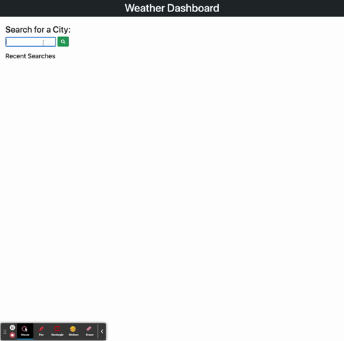

# Weather App

An app for travelers to search for the weather in different cities. You enter in a name of the city that you want to search for. This will make an API call to openweathermap.com. You will see the weather for that city as well as the 5-day forecast. This city is also added to your recent searches and local storage where you can search the city again.



|                                         |                                                               |                                                   |
| :-------------------------------------: | :-----------------------------------------------------------: | :-----------------------------------------------: |
|      [Introduction](#weather-app)       |            [Table of Contents](#table-of-contents)            | [Development Highlights](#development-highlights) |
|         [Deployment](#deployed)         | [Description of Page Building](#Description-of-Page-Building) |       [Code Hightlights](#code-highlights)        |
| [Technologies Used](#Technologies-Used) |                      [Credits](#Credits)                      |                [License](#License)                |

## Development Highlight

- Implement serverside API (openweathermap)
- Save and load data to local storage
- DOM manipulation based on API call
- Error handling for API call

## Deployment

[Deployment](https://anusontarangkul.github.io/weather-app/)

This app is deployed using GitHub pages.

## Description of Page Building

- assets
  - css
  - gif
  - js
- .gitignore
- index.html
- LICENSE
- README.md

This app hold all of the html in the index. The assets folder consists of the CSS and JavaScript for this app.

## Code Highlights

Making API call to openweather API. The city is taken as a parameter, which is the city being search. A variable is created to get the link of the API call. THe fetch method is used and then the format is formatted in JSON. We get the coordinates with this data to find the additional information and calling the recentSearch function to add the city to our recent searches. If the city is invalid, a catch is used to display to the user that the city doesn't exist.

```JavaScript
    const fetchCity = (city) => {
        let weatherURL = `${url + city}&appid=${APIkey}`
        fetch(weatherURL)
            .then(res => {
                if (!res.ok) throw res;
                return res.json()
            })
            .then(data => {
                getCoord(data)
                recentSearch(city);
            })
            .catch(err => {
                console.log(err)
                noCity(city);
            })
    }
```

THis function is used to create a recemt search feature. It takes in the recent searched city as the parameter. We use a citiesArray to keep track of the cities to add to local storage. A button is created using the search as the text and it is appended to the history-container ID. An onclick functionality is added to do the search again. The button is deleted and the city is removed from the array because we will be adding them again when it is fetched.

```JavaScript
    const recentSearch = (search) => {
        citiesArray.push(search)
        let newButton = $(`<button/>`,
            {
                text: search,
                "class": "recent-btn"
            }).appendTo("#history-container")
        newButton.click(function () {
            let recentCity = $(this).text()
            $(this).remove();
            citiesArray = citiesArray.filter(city => city !== recentCity)
            fetchCity(recentCity);
        })

        localStorage.setItem("savedCities", citiesArray)
    }
```

## Technologies Used

### Languages

- [HTML](https://www.w3schools.com/html/)
- [JavaScript](https://www.javascript.com/)
- [CSS](https://www.w3schools.com/css/)

### Design Libraries

- [Font-Awesome](https://fontawesome.com/)
- [Bootstrap](https://getbootstrap.com/)

## JavaScript Libraries

- [jQuery](https://jquery.com/)

## Server Side APIS

- [openweathermap](https://openweathermap.org/api)
- [moment.JS](https://momentjs.com/docs/)

## Credits

|                           |                                                                                                                                                                                                       |
| ------------------------- | ----------------------------------------------------------------------------------------------------------------------------------------------------------------------------------------------------- |
| **David Anusontarangkul** | [ LinkedIn](https://www.linkedin.com/in/anusontarangkul/) [ GitHub](https://github.com/anusontarangkul) |

## License

[](https://opensource.org/licenses/MIT)
